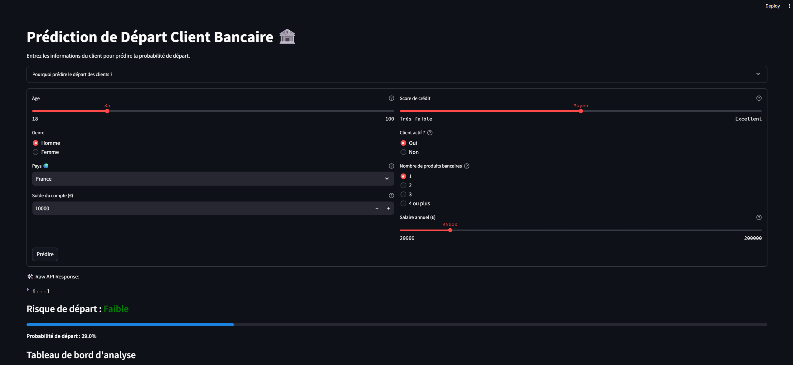
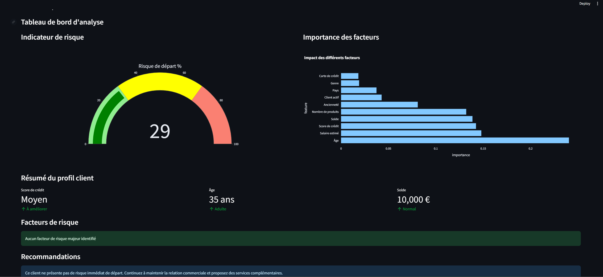

# 🏦 Bank Customer Churn Prediction App

A machine learning application that predicts customer churn probability for banking customers based on demographic (🇫🇷, 🇩🇪, 🇪🇸) and account information (Annual Salary, age, balance, credit score...etc)


## Overview

This application uses a RandomForest model trained on bank customer data to predict the likelihood of customer churn. It consists of:

- **ML Model** - Predicts churn probability based on customer attributes
- **FastAPI Backend** - Serves predictions through a REST API
- **Streamlit Frontend** - User-friendly interface for inputs and visualizations

## 📱 Application Interface
- Link UI [https://bank-churn-prediction-ml.streamlit.app/]

**Without backend API**⚠️

### Input Form

*Input form where users can enter customer information such as age, credit score, balance, and other relevant details.*

### Analysis Dashboard  📊

*Comprehensive dashboard showing risk analysis, feature importance, and customer profile summary.*

Key Features:
-  Risk gauge showing churn probability
-  Feature importance visualization
-  Customer profile summary
-  Risk factors identification
-  Actionable recommendations

### Prerequisites

- Python 3.8 or higher
- Git

### Installation

1. Clone the repository:
```bash
git clone https://github.com/ahmedbrh/ML-Churn-Streamlit-App.git
cd ML-Churn-Streamlit-App
```

2. activate a Venv:
```bash
python -m venv venv
source venv/bin/activate  # On Windows: venv\Scripts\activate
```

3. Install dependencies:
```bash
pip install -r requirements.txt
```

4. Download the dataset to the data directory:
```bash
mkdir -p data
# Download Churn_Modelling.csv from Kaggle to the data directory
```

5. Cmdline to Train the model:
```bash
python model/train_model.py
```

6. Start the FastAPI server :
```bash
uvicorn api.main:app --reload
```

7. start the Streamlit server frontend:
```bash
streamlit run frontend/app.py
```

8. Open your browser and navigate to: http://localhost:8501


## 📊 Dataset

This project uses the [Bank Customer Churn Prediction dataset](https://www.kaggle.com/datasets/adammaus/predicting-churn-for-bank-customers) from Kaggle which include features like 
- Customer demographics (age, gender, geography- (France, Germany, Spain))
- Account information (balance, tenure, products)
- Activity metrics (credit score, active status)

##  Docker Deployment

You can run this app easily using Docker. Make sure you have Docker installed on your machine.

### 1. Build the Docker image
```bash
docker build -t bank-churn-app .
```

### 2. Run the Docker container
```bash
docker run -p 8000:8000 bank-churn-app
```

- The app will be available at [http://localhost:8000/](http://localhost:8000/)
- The Streamlit frontend will be accessible at [http://localhost:8000/streamlit](http://localhost:8000/streamlit)

**Note:**
- If you need to retrain the model, run the training script locally and copy the resulting `model/model.joblib` into the container, or mount it as a volume.
- The default port is 8000. You can change it by setting the `PORT` environment variable when running the container.
